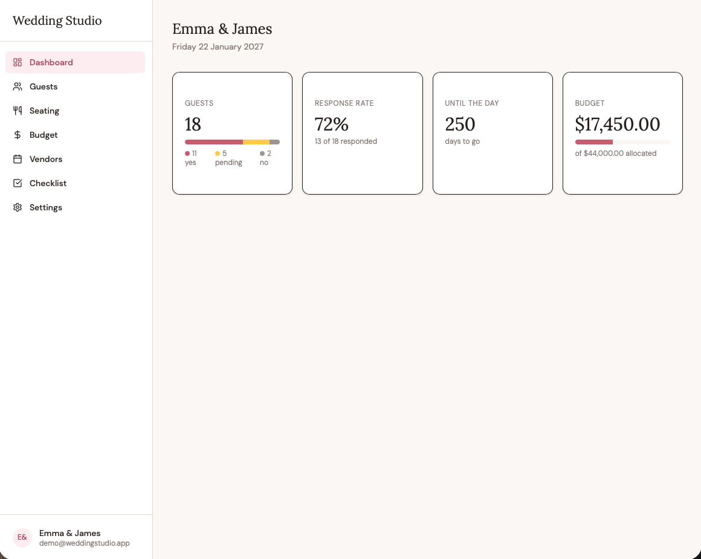
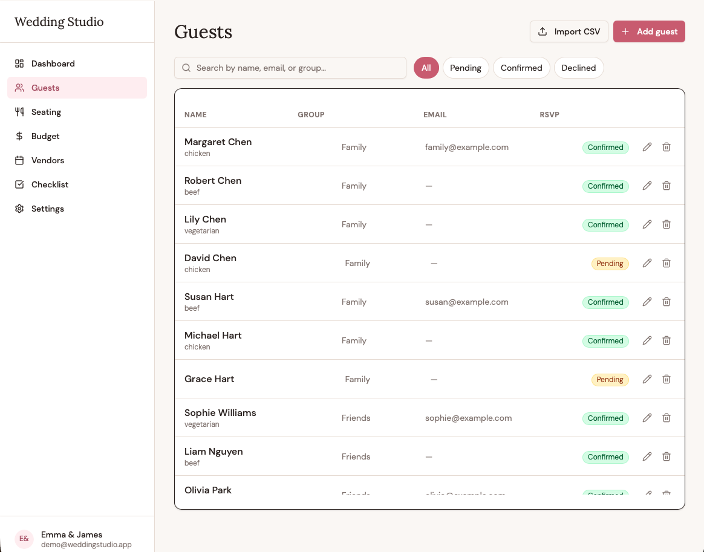
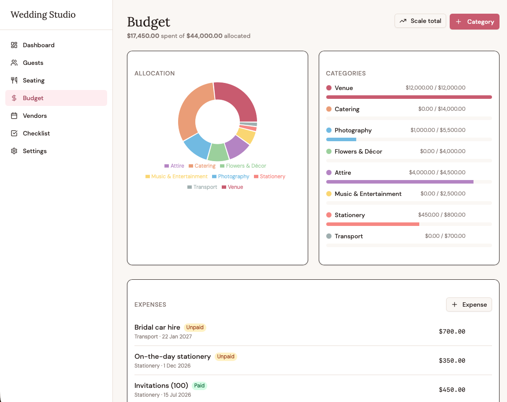
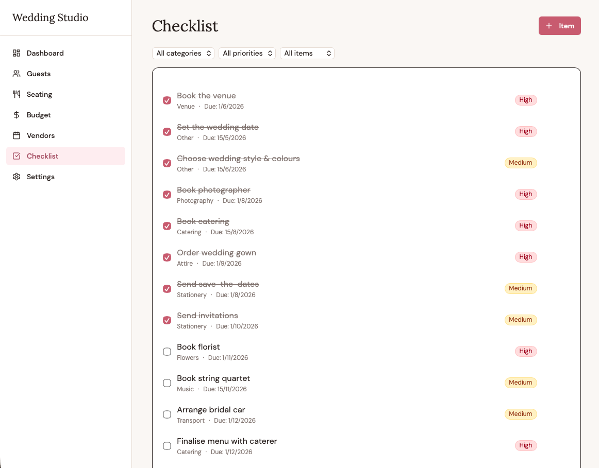
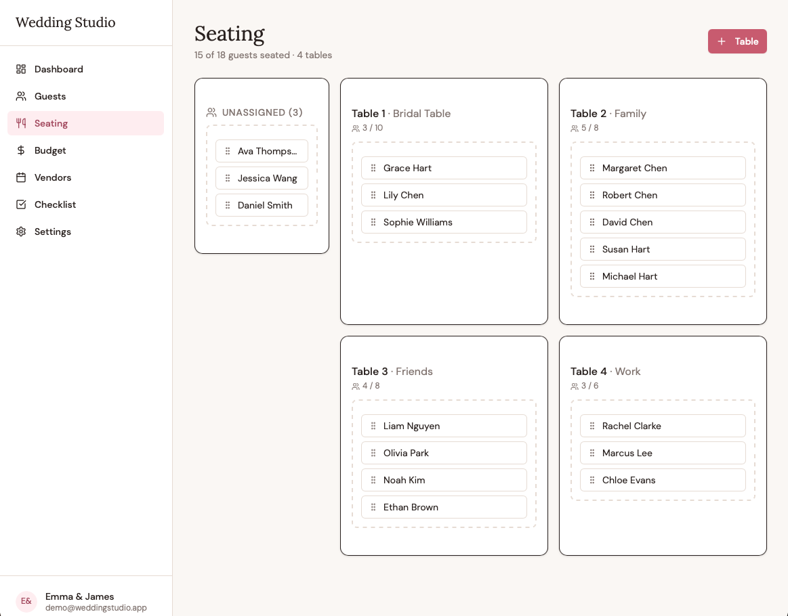
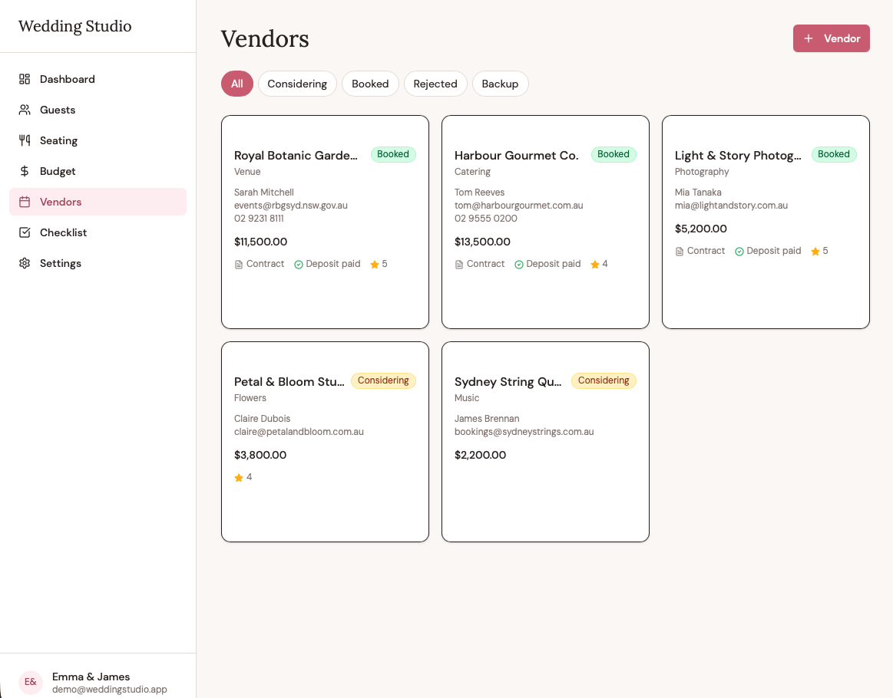
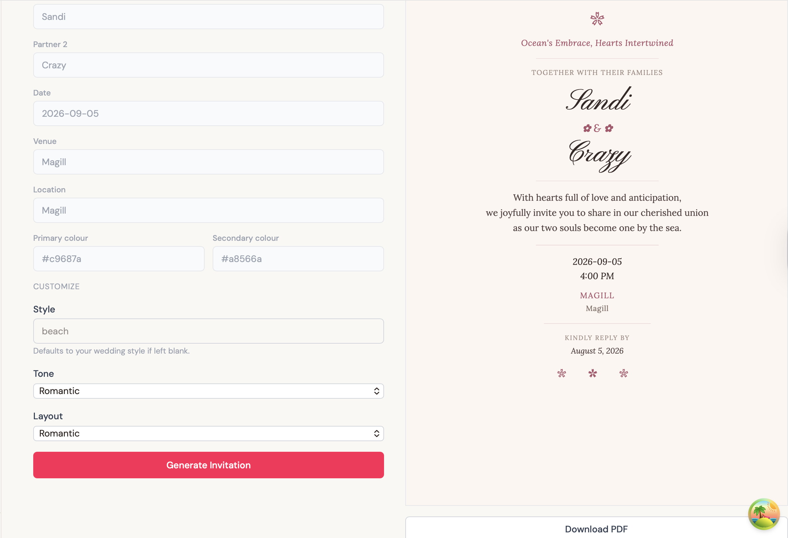

# Wedding Studio

A full-stack wedding planning application. Create an account, configure a wedding profile, and manage guests & RSVPs, budget & expenses, vendor contracts, a planning checklist, and drag-and-drop table seating — all from a single dashboard. An AI-powered invitation designer (Gemini 2.5 Flash) generates print-ready 5×7in cards from your wedding details and exports to PDF via the browser's native print dialog.

---

## Live Demo

**[wedding-studio-one.vercel.app](https://wedding-studio-one.vercel.app)**

| Field | Value |
|---|---|
| Email | `demo@weddingstudio.app` |
| Password | `DemoPass2026` |

The demo account is pre-populated with a full sample wedding (guests, budget, vendors, checklist, seating). No sign-up required.

---

## Screenshots









---

## Tech Stack

### Frontend
| Library | Version | Role |
|---|---|---|
| React | 19 | UI framework |
| TypeScript | 6 | Type safety |
| Vite | 8 | Build tool & dev server |
| Tailwind CSS | 4 | Styling |
| React Router | 7 | Client-side routing |
| TanStack Query | 5 | Server state, caching, invalidation |
| React Hook Form | 7 | Form state management |
| Zod | 4 | Schema validation |
| Radix UI | — | Accessible UI primitives |
| dnd-kit | — | Drag-and-drop seating chart |
| Recharts | 3 | Budget donut chart |
| Lucide React | — | Icons |
| @sentry/react | — | Error tracking & performance monitoring |

### Backend
| Library | Version | Role |
|---|---|---|
| FastAPI | ≥ 0.115 | HTTP framework, OpenAPI |
| SQLAlchemy | 2 | ORM |
| Alembic | ≥ 1.13 | Schema migrations |
| Pydantic / pydantic-settings | 2 | Validation & config |
| python-jose | ≥ 3.3 | JWT signing & verification |
| bcrypt | 4 | Password hashing |
| psycopg | 3 | PostgreSQL driver (psycopg3) |
| uvicorn | — | ASGI server |
| google-genai | ≥ 1.0 | Gemini 2.5 Flash — structured theme generation |
| sentry-sdk | — | Error tracking & performance monitoring |

### Infrastructure
| Component | Service |
|---|---|
| Frontend hosting | Vercel (CDN-distributed static assets) |
| Container registry | AWS ECR |
| Backend runtime | AWS ECS Express Mode (managed ALB + Fargate service) |
| Database | AWS RDS PostgreSQL 18.3 |
| Secrets | AWS Secrets Manager (DB URL, JWT secret, Gemini API key, Sentry DSN) |
| Observability | Sentry (frontend + backend, error tracking & performance) |
| Local dev DB | PostgreSQL 16 |

---

## Architecture

```
Browser
  │
  ├─── static assets ──▶ Vercel CDN (React SPA)
  │
  └─── API calls (HTTPS) ──▶ AWS ALB (managed by ECS Express Mode)
                                │
                                ▼
                         ECS Fargate task
                         (FastAPI container, pulled from ECR)
                                │
                         ┌──────┴──────┐
                         │             │
                         ▼             ▼
                    RDS PostgreSQL   AWS Secrets Manager
                    18.3 (SSL)       (DB URL, JWT secret,
                                      Gemini key, Sentry DSN —
                                      injected at task start)
```

The React SPA is a static build served from Vercel. All API calls go to an AWS ALB provisioned by ECS Express Mode, which forwards to the ECS Fargate task running the FastAPI container. The container reads its database URL and JWT secret from AWS Secrets Manager at startup (injected as environment variables by the ECS task definition). The database is AWS RDS PostgreSQL 18.3 with SSL enforced.

The FastAPI layer follows a three-schema pattern (Create / Update / Public) per resource, JWT authentication with refresh tokens (python-jose / HS256), RFC 7807 `application/problem+json` error responses, and cursor-based pagination for the guest list.

The invitation designer sends wedding details to Gemini 2.5 Flash using native Pydantic `response_schema` for structured output. The model returns a validated `GeneratedTheme` (colour palette, font pairings, invitation copy, layout choice) which is stored in the database and rendered client-side as a print-ready 5×7in React component — no server-side PDF generation required.

---

## Running Locally

### Prerequisites

- Python 3.12 (the backend pins to exactly 3.12)
- [uv](https://docs.astral.sh/uv/) (`pip install uv` or `brew install uv`)
- Node.js 20+
- PostgreSQL 16+ running locally

### 1. Create the databases

```bash
createdb wedding_studio
createdb wedding_studio_test   # used by the test suite
```

### 2. Backend

```bash
cd backend

uv venv                        # creates .venv using Python 3.12
source .venv/bin/activate
uv pip install -e ".[dev]"

cp .env.example .env
# Edit .env — two required fields:
#   SQLALCHEMY_DATABASE_URL=postgresql+psycopg://<your-pg-user>@localhost:5432/wedding_studio
#   JWT_SECRET_KEY=<output of: openssl rand -hex 32>
```

The URL scheme is `postgresql+psycopg://` (psycopg3) — not `postgresql://` (which defaults to psycopg2). On a Homebrew Postgres with no password, the URL is typically:
```
postgresql+psycopg://your-macos-username@localhost:5432/wedding_studio
```

```bash
alembic upgrade head           # runs all migrations against wedding_studio
uvicorn api.main:app --reload --port 8000
```

Interactive API docs: [http://127.0.0.1:8000/api/v1/docs](http://127.0.0.1:8000/api/v1/docs)

### 3. Frontend

```bash
cd frontend
npm install          # .npmrc sets legacy-peer-deps=true — plain install works
npm run dev          # http://localhost:5173 — Vite proxies /api → localhost:8000
```

Both servers must be running. The Vite dev proxy handles CORS; no `VITE_API_URL` is needed locally.

### Seed demo data (optional)

```bash
cd backend
source .venv/bin/activate
python scripts/seed_demo.py
```

Creates `demo@weddingstudio.app` / `DemoPass2026` with guests, vendors, budget, checklist, and seating data. Idempotent — safe to run multiple times.

---

## Testing

```bash
# Backend — 188 tests
cd backend
source .venv/bin/activate
pytest -q

# Frontend unit tests — Vitest + Testing Library
cd frontend
npm run test

# Frontend end-to-end — Playwright (auto-starts both servers)
cd frontend
npm run e2e
```

Backend tests run against a real local PostgreSQL database. The database URL is read from the `TEST_DATABASE_URL` environment variable, defaulting to `postgresql+psycopg://localhost:5432/wedding_studio_test`; set the variable if your local setup requires a username or password.

Each test wraps its work in a transaction that is always rolled back: a session-scoped engine creates the schema once, then every test function gets a `begin_nested()` savepoint so that `session.commit()` calls inside application code do not persist between tests. This was a deliberate choice — SQLite in-process testing masked two dialect-specific bugs that only appeared against real Postgres; running against the same engine family as production caught them.

---

## Production Notes & Known Tradeoffs

These are deliberate portfolio tradeoffs, not oversights. Each entry includes what production would do differently.

**RDS is publicly accessible, gated by security group + SSL**
The RDS instance accepts connections only from the ECS task's security group on port 5432, and SSL is enforced at the connection string level (`sslmode=require`). For a production service: deploy into a private subnet with no internet-facing endpoint; reach the database over private IP via VPC routing.

**Single ECS task — rolling replace, no blue/green**
During a deploy, ECS replaces the single running task with the new revision (we observed `Running: 2` in the console during this period). ECS circuit breaker with automatic rollback is enabled — if the new task fails health checks, ECS rolls back to the previous revision. There is still no blue/green separation: traffic is not shifted gradually, so there is a brief window with zero healthy tasks if the old task stops before the new one passes its health check. Production: run two tasks minimum; use CodeDeploy blue/green for zero-downtime cutover.

**Gemini free tier may use inputs for model training**
Requests sent to the Gemini API on the free tier are subject to Google's data-use policy, which permits using inputs to improve models. For a production service handling real wedding data: use a paid tier (Gemini API paid plans opt out of training use), or run a self-hosted open-weight model. The invitation form sends only wedding metadata (names, date, venue, style) — no guest lists or financial data.

**`designs.html_content` stores JSON, not HTML**
The `Design` model has an `html_content` column (VARCHAR) that the legacy Flask app used for rendered HTML. Phase 7 repurposed it to store `GeneratedTheme` JSON, avoiding a schema migration. The column name is misleading — a future cleanup would rename it to `theme_json` or migrate to a proper `JSONB` column on PostgreSQL. The data is valid and readable; only the name is wrong.

**Token invalidation is client-side only**
Logout clears the JWT from `localStorage`. The server has no blocklist, so a stolen token remains valid until expiry (15-minute access tokens, 7-day refresh tokens). Production: Redis-backed token blocklist checked on every request, or short-lived access tokens with server-side refresh token rotation.

---

## Repository

131 commits across 7 phases:

| Phase | Work |
|---|---|
| 1 | Repo hygiene: uv, Ruff, Black, pre-commit, monorepo layout |
| 2 | Extract inline CSS/JS from Jinja templates |
| 3 | FastAPI JSON API — 9 resources, 30+ endpoints, JWT auth, RFC 7807, 188 tests |
| 4 | React + TypeScript SPA; removed legacy Flask/Jinja frontend entirely |
| 5 | Production deployment: Docker, ECR, ECS Fargate, RDS PostgreSQL, Vercel |
| 6 | DB-level FK cascade; GitHub Actions CI/CD with OIDC + digest-pinned ECS deploys; local Postgres aligned to 18.x |
| 7 | Sentry observability (frontend + backend); AI invitation designer — Gemini 2.5 Flash, three print-ready layouts, browser-native PDF export |

Architecture decisions are documented in [docs/architecture.md](docs/architecture.md) (backend) and [docs/architecture-frontend.md](docs/architecture-frontend.md) (frontend).
